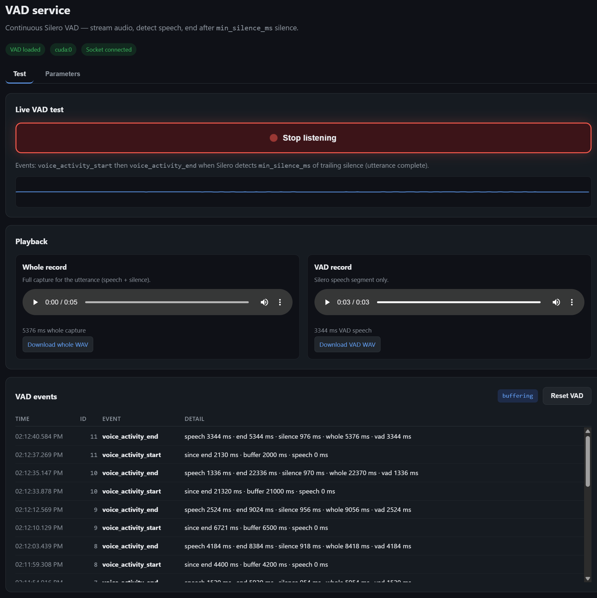

# VAD Service

Standalone Silero VAD microservice for continuous voice-activity detection. Streams PCM audio in, runs **Silero `VADIterator`** (32 ms windows, stateful) on each chunk, emits lifecycle events over Socket.IO, and stores two WAV recordings per utterance (whole capture + speech-only clip) retrievable via REST.



## Quick start

```bash
git clone https://github.com/tuannv-github/vad-service.git
cd vad-service
cp .env.example .env          # optional
docker compose up -d --build
```

- **GUI (client):** http://localhost:14120
- **API (backend):** `curl http://localhost:14020/health`

## Architecture

```
Client (browser or HTTP client)
    │  PCM chunks (16 kHz int16)
    ▼
Socket.IO  audio_stream  ──or──  REST POST /v1/sessions/{id}/audio
    │
    ▼
VadEngine → VadPipeline → StreamVAD (VADIterator, 512 samples / 32 ms)
    │
    ├── Socket.IO events (vad_status, request_stats, …)
    └── UtteranceRecording (full_pcm + vad_pcm in memory)
            │
            └── REST GET …/recordings/{seq}/full|vad
```

| Component | Role |
|-----------|------|
| `backend/vad.py` | Silero JIT load + per-session `StreamVAD` / `VADIterator` |
| `backend/vad_pipeline.py` | Buffer audio, feed stream frames, utterance start/end logic |
| `backend/engine.py` | REST + Socket.IO handlers, recording storage |
| `backend/settings.py` | Runtime Silero parameters (`config/vad_defaults.json` + `data/vad_settings.json`) |
| `frontend/` | Config GUI + live mic test |
| `scripts/entrypoint.sh` | Docker entrypoint; uvicorn `--reload` when `VAD_RELOAD=true` |

## Detection procedure

Audio is processed in **streaming mode**:

1. Incoming PCM is appended to the session buffer (for whole-record playback).
2. Audio is split into **512-sample frames** (32 ms @ 16 kHz) and fed to Silero's **`VADIterator`**, which keeps LSTM state between frames (O(1) per window, no full-buffer re-scan).
3. When speech is detected, the service emits **`voice_activity_start`** (and legacy **`speech_started`**).
4. While speech continues, each chunk emits **`speech_ongoing`** with updated `speech_ms`.
5. When **`min_silence_ms`** of trailing silence is reached, the service emits **`voice_activity_end`**, stores recordings, then returns to **`buffering`**.

Public Socket.IO / REST events are **`voice_activity_start`** and **`voice_activity_end`** (plus `speech_ongoing`, `buffering`, etc.), matching Silero's internal `{start}` / `{end}` signals.

```
1. buffering
      Client sends PCM chunks. No speech detected yet.

2. voice_activity_start
      Silero finds speech. Payload: offset_ms, speech_ms, optional since_end_ms.
      Also emits speech_started (legacy alias).

3. speech_ongoing
      Chunks keep arriving while speech is active.

4. voice_activity_end
      Silero min_silence_ms reached — utterance complete.
      Recordings stored (whole + vad). Payload includes timing fields, audio_b64, REST URLs.
      request_stats emitted with pipeline timing.

5. buffering
      Session ready for the next utterance. Stored recordings remain until reset or disconnect.
```

### Whole vs VAD recording

| Recording | Time range | Use |
|-----------|------------|-----|
| **whole** (`…/full`) | Start of utterance buffer → end of buffer at `voice_activity_end` | Full context including silence before/after speech |
| **vad** (`…/vad`) | `voice_activity_start` → `voice_activity_end` (speech segment only) | Speech clip for downstream use; internal pauses within the utterance are kept |

## Web GUI

Open http://localhost:14120 (or `VAD_CLIENT_PORT`).

| Tab | Purpose |
|-----|---------|
| **Test** | Start/stop mic streaming, waveform, event log; load whole + VAD recordings from REST after `voice_activity_end` (manual play on `<audio controls>`) |
| **Parameters** | Live-tune Silero settings; per-field **Reset** or **Reset defaults** from `config/vad_defaults.json`; active values in `data/vad_settings.json` |

**Microphone over HTTP:** browsers require `localhost`, HTTPS, or Chrome's [insecure origins flag](chrome://flags/#unsafely-treat-insecure-origin-as-secure). The GUI shows a setup modal when mic access is blocked.

## REST API

Base URL: `http://localhost:14020` (backend) or `http://localhost:14120` (client) — container internal port `8080`.

### Health & config

| Method | Path | Description |
|--------|------|-------------|
| `GET` | `/health` | Service status, model loaded, GPU device, current settings |
| `GET` | `/api/config` | Current VAD parameters (from `vad_settings.json` if present) |
| `GET` | `/api/config/defaults` | Values from `config/vad_defaults.json` |
| `PUT` | `/api/config` | Update parameters (JSON body, partial OK). Persists to `vad_settings.json`. Invalidates active VAD streams. |
| `POST` | `/api/config/reset` | Reset all parameters from `vad_defaults.json` and overwrite `vad_settings.json` |

**Example — change threshold and silence gap:**

```bash
curl -X PUT http://localhost:14020/api/config \
  -H 'Content-Type: application/json' \
  -d '{"threshold": 0.5, "min_silence_ms": 150}'
```

**Reset to defaults file:**

```bash
curl -X POST http://localhost:14020/api/config/reset
```

### Session audio (HTTP alternative to Socket.IO)

`client_id` is any string you choose (Socket.IO clients use their `sid`).

| Method | Path | Description |
|--------|------|-------------|
| `POST` | `/v1/sessions/{client_id}/audio` | Feed a PCM chunk |
| `POST` | `/v1/sessions/{client_id}/end_speech` | Force end current utterance |
| `POST` | `/v1/sessions/{client_id}/inference_state` | `{"running": true}` — suppress new detections while LLM runs |
| `POST` | `/v1/sessions/{client_id}/reset` | Clear buffers and stored recordings |

**Audio payload** (`POST …/audio`):

```json
{
  "audio": "<base64 int16 PCM>",
  "format": "base64",
  "sample_rate": 16000
}
```

Also accepts `"audio": [byte, byte, …]` (int list) without `format`.

Response:

```json
{
  "events": [{"event": "vad_status", "data": {"status": "speech_ongoing"}}],
  "cancel_inference": false
}
```

### Recordings

| Method | Path | Description |
|--------|------|-------------|
| `GET` | `/v1/sessions/{client_id}/recordings` | List utterances with metadata and URLs |
| `GET` | `/v1/sessions/{client_id}/recordings/{seq}/full` | Download whole WAV |
| `GET` | `/v1/sessions/{client_id}/recordings/{seq}/vad` | Download VAD speech WAV |
| `GET` | `/v1/sessions/{client_id}/recordings/latest/full` | Latest whole WAV |
| `GET` | `/v1/sessions/{client_id}/recordings/latest/vad` | Latest VAD WAV |

**List example:**

```bash
curl http://localhost:14020/v1/sessions/my-client/recordings
```

```json
{
  "recordings": [
    {
      "utterance_seq": 1,
      "sample_rate": 16000,
      "full_duration_sec": 4.2,
      "vad_duration_sec": 2.8,
      "full_url": "/v1/sessions/my-client/recordings/1/full",
      "vad_url": "/v1/sessions/my-client/recordings/1/vad"
    }
  ]
}
```

Recordings are held in memory per session until `reset` or disconnect.

## Socket.IO

Path: `/socket.io` on the same host/port.

### Client → server

| Event | Payload | Description |
|-------|---------|-------------|
| `audio_stream` | `{ audio, format?, sample_rate }` | PCM chunk (same formats as REST) |
| `end_speech` | — | Force end current utterance |
| `reset_state` | — | Clear session |
| `set_inference_running` | `{ running: bool }` | LLM busy flag |
| `enable_vad_test` | — | GUI test-mode handshake |

### Server → client

| Event | Description |
|-------|-------------|
| `vad_status` | Lifecycle updates (see statuses below) |
| `request_stats` | Timing breakdown on `voice_activity_end` |
| `audio_stream_received` | Ack per chunk (mirrors status) |

**`vad_status` values:**

| Status | Meaning |
|--------|---------|
| `buffering` | Listening, no speech yet (or between utterances) |
| `voice_activity_start` | Speech begins (`offset_ms`, `speech_ms`, optional `since_end_ms`, `utterance_seq`) |
| `voice_activity_end` | Utterance complete — `min_silence_ms` reached; recordings + `audio_b64` |
| `speech_started` | Legacy alias for `voice_activity_start` |
| `speech_ongoing` | Audio streaming while utterance is active |
| `idle` | After `reset_state` |

**`voice_activity_end` payload (key fields):**

```json
{
  "status": "voice_activity_end",
  "utterance_seq": 1,
  "full_duration_sec": 4.2,
  "vad_duration_sec": 2.8,
  "full_duration_ms": 4200,
  "vad_duration_ms": 2800,
  "silence_ms": 124,
  "speech_ms": 2800,
  "end_ms": 3100,
  "full_url": "/v1/sessions/{sid}/recordings/1/full",
  "vad_url": "/v1/sessions/{sid}/recordings/1/vad",
  "audio_b64": "...",
  "audio_wav_b64": "...",
  "sample_rate": 16000
}
```

**Minimal JS client:**

```javascript
const socket = io("http://localhost:14120", { path: "/socket.io" });

socket.on("connect", () => console.log("sid", socket.id));

socket.on("vad_status", (data) => {
  if (data.status === "voice_activity_end" && data.full_url) {
    document.getElementById("whole").src = data.full_url;
    document.getElementById("vad").src = data.vad_url;
  }
});

socket.emit("audio_stream", {
  audio: base64Pcm,
  format: "base64",
  sample_rate: 16000,
});
```

## Configuration

Two JSON files:

| File | Purpose |
|------|---------|
| `config/vad_defaults.json` | Canonical defaults — **Reset** / **Reset defaults** load from here |
| `data/vad_settings.json` | Active runtime values — written by **Save parameters** (tracked in git) |

On startup, defaults load from `vad_defaults.json`, then `vad_settings.json` is applied if it exists.

**Silero parameters** (in `config/vad_defaults.json`):

| Field | Default | Description |
|-------|---------|-------------|
| `threshold` | `0.8` | Silero speech probability (0–1) |
| `min_speech_ms` | `250` | Minimum speech segment length |
| `min_silence_ms` | `1000` | Trailing silence before `voice_activity_end` |
| `speech_pad_ms` | `100` | Pad around Silero segments |
| `neg_threshold` | `null` | Silero exit threshold; empty = `threshold − 0.15` |
| `max_speech_duration_s` | `null` | Force split after N seconds; empty = unlimited |

**Environment** (`.env` / compose — service runtime, not VAD tuning):

| Variable | Default | Description |
|----------|---------|-------------|
| `VAD_DEVICE` | `cuda` | `cuda`, `cuda:0`, or `cpu` |
| `VAD_BACKEND_PORT` | `14020` | Host port for API / backend clients |
| `VAD_CLIENT_PORT` | `14120` | Host port for browser GUI / Socket.IO clients |
| `VAD_SAVE_SPEECH` | `false` | Also write VAD clips to disk (`VAD_SAVE_DIR`) |
| `VAD_RELOAD` | `false` | Auto-restart on `backend/*.py` changes (Docker entrypoint) |
| `VAD_RELOAD_DELAY` | `0.5` | Debounce before uvicorn reload (seconds) |
| `WATCHFILES_FORCE_POLLING` | `false` | Set `true` in Docker for bind-mount file events |
| `VAD_DEFAULTS_PATH` | `config/vad_defaults.json` | Override path to defaults JSON |
| `VAD_SETTINGS_PATH` | `data/vad_settings.json` | Override path to active settings JSON |
| `PYTORCH_IMAGE` | `nvcr.io/nvidia/pytorch:25.02-py3` | Docker base image |

The Parameters tab documents each Silero field. Edit `config/vad_defaults.json` to change what **Reset** restores.

## Development

`docker-compose.yaml` bind-mounts `./backend`, `./frontend`, `./config`, and `./data`. **Frontend** changes only need a browser refresh; **backend** `.py` changes need reload enabled.

```bash
# Recommended: dev overlay sets VAD_RELOAD + polling
./dev.sh

# Or enable in .env then:
docker compose up --build

# Local (no Docker; requires GPU + PyTorch)
cd backend
VAD_PORT=14020 VAD_RELOAD=true python main.py
```

When reload is active, container logs show `VAD dev reload: watching /app/backend/*.py`, then `WatchFiles detected changes` on save.

### Tests

From `backend/`:

```bash
python test_double_utterance.py
python test_pipeline_reset.py
python test_timeline_trim.py
```

## Docker notes

- Requires **NVIDIA GPU** + [Container Toolkit](https://docs.nvidia.com/datacenter/cloud-native/container-toolkit/latest/install-guide.html).
- Silero JIT model is extracted at image build time to `/app/models/silero_vad.jit`.
- `data/vad_settings.json` is tracked in git so active tuning is shared; Docker bind-mount still allows live GUI saves.
- `config/vad_defaults.json` is mounted read-only; edit on the host to change reset defaults.
- Dev bind mounts: `./backend`, `./frontend` — no image rebuild needed for code edits when reload is on.
